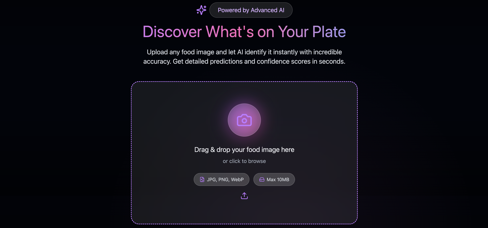
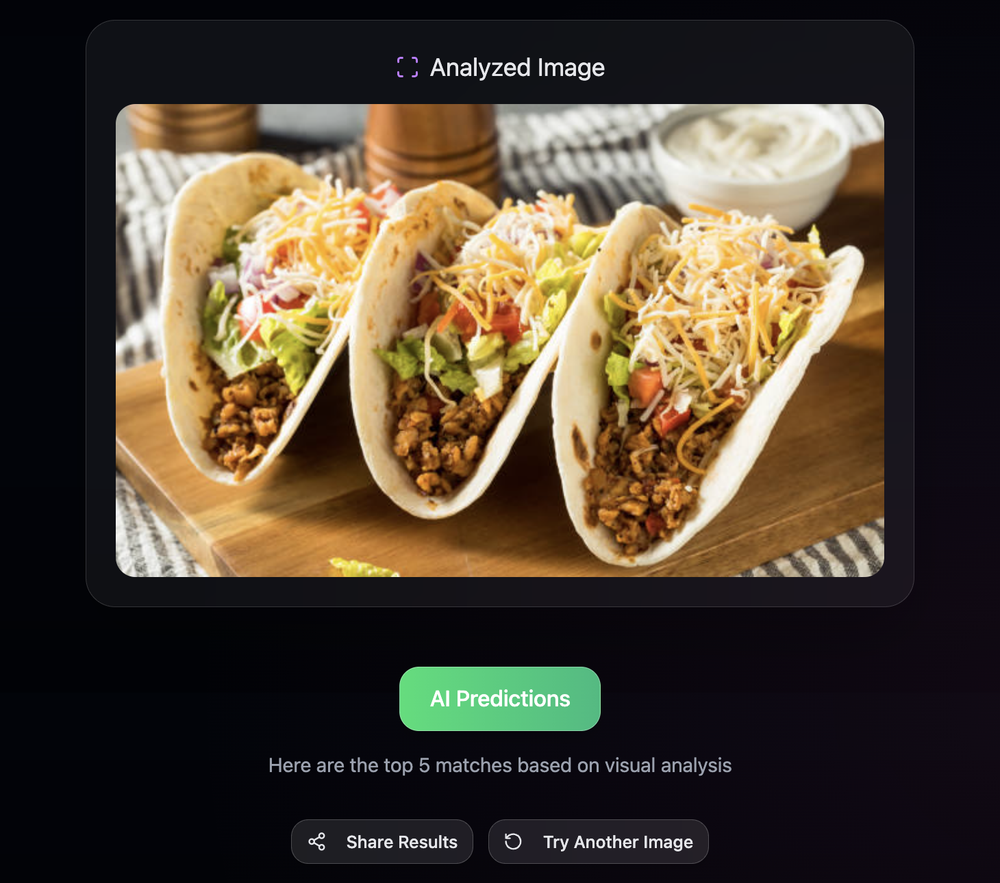
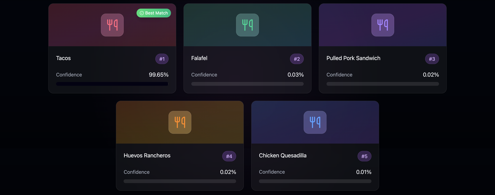

# FoodVisionAI

<div align="center">


**AI-Powered Food Recognition in Your Browser**

*Upload any food image and get instant AI-powered identification with confidence scores*

[](https://foodvisionai.vercel.app/)
[](https://www.linkedin.com/posts/rishabh-ranjan-singh_opensource-ai-voiceai-activity-7386952027756687360-gJJB?utm_source=social_share_send&utm_medium=member_desktop_web&rcm=ACoAAFFUAW4BZLDDmOzPMOYLV-v19zDfIgL3Eho)
[](https://github.com/Rishabh1925/foodvisionai/issues)


</div>

---

## What is FoodVisionAI?

**FoodVisionAI** is a modern web application that instantly identifies food items from images using advanced artificial intelligence. Simply upload a photo, and within 1-2 seconds, get accurate predictions with detailed confidence scores for 101 different food categories. Built with a beautiful glassmorphism UI and powered by Hugging Face's state-of-the-art Vision Transformer model, it combines cutting-edge machine learning with an intuitive user experience.

Everything runs locally with no external API calls, ensuring complete privacy. No API keys needed, no usage limits, completely free and open-source. Perfect for food bloggers, nutritionists, recipe apps, or anyone curious about their meals.

---

## Features

- **AI-Powered Recognition** - Advanced Vision Transformer model trained on 101 food categories
- **Lightning Fast** - Get results in 1-2 seconds with instant predictions
- **Beautiful UI** - Modern glassmorphism design with smooth animations and responsive layout
- **Top 5 Predictions** - Detailed confidence scores showing the model's certainty
- **Fully Responsive** - Works seamlessly on desktop, tablet, and mobile devices
- **Privacy First** - All processing happens locally, no data sent to external servers
- **Completely Free** - No API keys required, no usage limits, 100% open-source
- **94% Accuracy** - Highly accurate predictions powered by the Food-101 dataset

---

## Quick Start

### Prerequisites

- **Python 3.8+** (Python 3.13 recommended)
- **Node.js 16+** (18+ recommended)
- **pip** and **npm** package managers

### Installation

1. **Clone the repository**
   ```bash
   git clone https://github.com/Rishabh1925/foodvisionai.git
   cd foodvisionai
   ```

2. **Set up the backend**
   ```bash
   # Create and activate virtual environment
   python3 -m venv venv
   source venv/bin/activate                 # On Windows: venv\Scripts\activate
   
   # Install Python dependencies
   pip install -r backend/requirements.txt
   ```

3. **Set up the frontend**
   ```bash
   cd frontend
   npm install
   cd ..
   ```

### Running the Application

You'll need two terminal windows:

**Terminal 1 - Backend Server:**
```bash
source venv/bin/activate                    # On Windows: venv\Scripts\activate
python backend/app.py
```
The backend API will start at `http://localhost:8000`

**Terminal 2 - Frontend Development Server:**
```bash
cd frontend
npm run dev
```
The frontend will start at `http://localhost:3000`

### Your First Prediction

1. Open your browser and navigate to `http://localhost:3000`
2. Click the "Upload Image" button or drag and drop a food image
3. Wait 1-2 seconds while the AI processes your image
4. View the top 5 predictions with confidence scores!

**Tip:** The model downloads automatically on first run (~500MB). This may take a few minutes depending on your internet speed.

---

## Project Structure

```
foodvisionai/
├── backend/                        # Flask API Server
│   ├── app.py                      # Main Flask application & API routes
│   ├── model.py                    # AI model loading & prediction logic
│   ├── config.py                   # Configuration settings
│   └── requirements.txt            # Python dependencies
├── frontend/                       # React Frontend
│   ├── src/                        # Source code
│   │   ├── components/             # React components
│   │   ├── App.tsx                 # Main application
│   │   └── main.tsx                # Entry point
│   ├── public/                     # Static assets & favicon
│   ├── package.json                # Node dependencies
│   └── vite.config.ts              # Vite build configuration
├── venv/                           # Python virtual environment (git-ignored)
├── screenshots/
└── README.md               
```

---

## Screenshots

### Upload Interface


### Input Image


### Prediction Results


---

## Tech Stack

### Frontend
- **React 18.3.1** - Modern UI library with hooks
- **TypeScript** - Type-safe development
- **Vite** - Lightning-fast build tool and dev server
- **Tailwind CSS** - Utility-first styling framework
- **Framer Motion** - Smooth animations and transitions
- **Radix UI** - Accessible component primitives

### Backend
- **Flask 3.0.0** - Lightweight Python web framework
- **Python 3.13** - Latest Python features
- **Hugging Face Transformers** - Pre-trained AI models
- **PyTorch** - Deep learning framework
- **Pillow (PIL)** - Image processing library

### AI Model
- **Model**: `nateraw/food` from Hugging Face Hub
- **Architecture**: Vision Transformer (ViT)
- **Dataset**: Food-101 (101,000 images across 101 categories)
- **Accuracy**: ~94% on test data
- **Size**: ~500MB

---

## API Documentation

### Health Check
```http
GET /api/health
```

**Response:**
```json
{
  "status": "healthy",
  "message": "FoodVisionAI API is running"
}
```

### Food Prediction
```http
POST /api/predict
Content-Type: multipart/form-data
```

**Request Body:**
- `image`: Food image file (JPG, PNG, WebP, GIF)
- Max file size: 10MB

**Success Response:**
```json
{
  "success": true,
  "predictions": [
    {
      "class": "pizza",
      "confidence": 95.23
    },
    {
      "class": "hamburger",
      "confidence": 3.45
    },
    {
      "class": "sushi",
      "confidence": 0.89
    }
  ],
  "message": "Food classification completed successfully"
}
```

**Error Response:**
```json
{
  "success": false,
  "error": "No image file provided"
}
```

### Example Usage

**JavaScript/TypeScript:**
```javascript
const formData = new FormData();
formData.append('image', imageFile);

const response = await fetch('http://localhost:8000/api/predict', {
  method: 'POST',
  body: formData,
});

const result = await response.json();
console.log(result.predictions);
```

**Python:**
```python
import requests

with open('food_image.jpg', 'rb') as f:
    files = {'image': f}
    response = requests.post('http://localhost:8000/api/predict', files=files)
    result = response.json()
    
for pred in result['predictions']:
    print(f"{pred['class']}: {pred['confidence']:.2f}%")
```

**cURL:**
```bash
curl -X POST http://localhost:8000/api/predict \
  -F "image=@food_image.jpg"
```

---

## Supported Food Categories

The AI model recognizes **101 different food types**, including:

**Main Dishes:** Pizza, Hamburger, Sushi, Ramen, Pad Thai, Lasagna, Tacos, Burrito  
**Desserts:** Cheesecake, Ice Cream, Apple Pie, Chocolate Cake, Tiramisu, Donuts  
**Salads:** Caesar Salad, Greek Salad, Caprese Salad  
**Seafood:** Grilled Salmon, Lobster, Shrimp, Oysters, Scallops  
**Breakfast:** Pancakes, Waffles, French Toast, Omelette  
**International:** Bibimbap, Pho, Paella, Falafel, Gyoza, Samosa  

...and 70+ more categories!

---

## Troubleshooting

### Common Issues

**Model Download Fails**
- Ensure stable internet connection
- Check available disk space (~1GB for model cache)
- Model downloads to `~/.cache/huggingface/`
- Try: `rm -rf ~/.cache/huggingface/` and restart

**CORS Errors**
- Ensure frontend runs on `http://localhost:3000`
- Backend should be on `http://localhost:8000`
- Check CORS settings in `backend/config.py`

**Port Already in Use**
- Backend: Kill process on port 8000 or change port in `backend/app.py`
- Frontend: Kill process on port 3000 or Vite will auto-suggest another port

**Image Upload Fails**
- Check file size (max 10MB)
- Ensure valid image format (PNG, JPG, JPEG, GIF, WebP)
- Check browser console for specific error messages

**Slow Predictions**
- First prediction takes longer (model loading)
- Ensure you have ~2GB RAM available
- Close resource-intensive applications
- Consider resizing large images before upload

### Performance Optimization

**For Better Speed:**
- Use GPU if available (automatically detected)
- Resize images to max 800x800px before upload
- Ensure Python virtual environment is activated
- Use production build for frontend: `npm run build`

**For Lower Memory Usage:**
- Set `device='cpu'` in `backend/model.py` to force CPU
- Reduce image resolution before upload
- Restart backend server periodically

### Getting Help

1. Check existing [GitHub Issues](https://github.com/Rishabh1925/foodvisionai/issues)
2. Review this troubleshooting section
3. Create a new issue with:
   - Operating system and version
   - Python and Node.js versions
   - Complete error messages
   - Steps to reproduce the problem

---

## Contributing

Contributions are welcome! Here's how you can help:

### Ways to Contribute

- **Report bugs** - Found an issue? Open a bug report
- **Suggest features** - Have an idea? Create a feature request
- **Improve docs** - Fix typos, add examples, clarify instructions
- **Enhance UI** - Improve design, add animations, fix responsiveness
- **Optimize code** - Improve performance, refactor, add tests

### Development Workflow

1. **Fork** the repository
2. **Create** a feature branch
   ```bash
   git checkout -b feature/amazing-feature
   ```
3. **Make** your changes
4. **Test** thoroughly (both backend and frontend)
5. **Commit** with descriptive messages
   ```bash
   git commit -m "Add: amazing new feature"
   ```
6. **Push** to your fork
   ```bash
   git push origin feature/amazing-feature
   ```
7. **Open** a Pull Request with a clear description

### Code Style

- **Python**: Follow PEP 8, use type hints
- **TypeScript/React**: Follow Airbnb style guide
- **Commits**: Use conventional commits (feat:, fix:, docs:, etc.)

---

## License

This project is licensed under the **MIT License** - see the [LICENSE](LICENSE) file for details.

You are free to use, modify, and distribute this software for any purpose, commercial or non-commercial.

---

## Acknowledgments

- [Hugging Face](https://huggingface.co/) - For providing the pre-trained model infrastructure
- [Food-101 Dataset](https://data.vision.ee.ethz.ch/cvl/datasets_extra/food-101/) - Training data creators
- [Nate Raw](https://huggingface.co/nateraw) - For the fine-tuned food classification model
- React & Flask Communities - For excellent documentation and support
- [Radix UI](https://www.radix-ui.com/) - For accessible component primitives

---

## Contact & Links

**Developer:** Rishabh Ranjan Singh

[](https://github.com/Rishabh1925)
[](https://www.linkedin.com/in/rishabh-ranjan-singh/)

</div>
